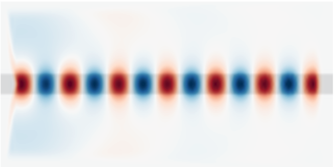
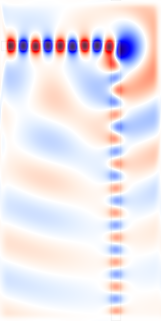
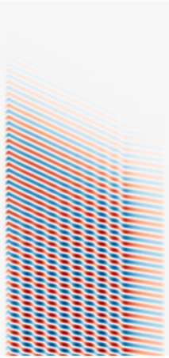

# Meep Python 基础教程

我们将通过几个使用Python接口的例子来演示计算场、透射/反射光谱和谐振模式的过程。这些例子主要是1d或2d仿真，只是因为它们比3d更快，而且它们说明了大部分的基本功能。更多涉及3D仿真的高级功能，请参见[Simpetus](http://www.simpetus.com/projects.html)项目页面。

## 目录

## Meep 库

Meep 使用 Python 脚本进行仿真，仿真涉及到指定器件的几何形状、材料、光源、监控器区域，以及其他一切必要的计算设置。Python 脚本提供的灵活性，可以为几乎任何应用定制仿真，特别是那些涉及参数扫描和优化的仿真。Python库，如 [NumPy](http://www.numpy.org/) 、[SciPy](https://www.scipy.org/) 和 [Matplotlib](https://matplotlib.org/) 等，可以用来增强仿真功能性，并将进行演示。大部分低级 C++ 接口的功能已经在 Python 中被抽象出来，这意味着你不需要成为一个有经验的程序员就可以设置仿真。在必要的时候，提供合理的默认值。

通常在Unix命令行中执行Meep仿真的过程如下

``` shell
unix% python foo.py >& foo.out
```

读取 Python 脚本 foo.py 并执行它，将输出保存到 foo.out 文件中。如果在交互式模式下设置仿真，你可以输入命令并立即看到结果，你需要通过shell终端使用IPython，或者通过浏览器使用Jupyter Notebook。如果你使用这些方法中的一种，你可以将教程中的命令粘贴进去，并在后面的教程中看到它们的作用。

## 波导领域

对于我们的第一个例子，让我们研究一下波导中的局部 [连续波（CW）](https://en.wikipedia.org/wiki/Continuous_wave) 源激发的场型-先是直的，然后弯折。该波导将具有频率无关的相对介电常数ε=12，宽度为1μm。这个例子中的单位长度是1μm。另见[Units](https://meep.readthedocs.io/en/latest/Introduction/#units-in-meep)。

### 长直波导

仿真脚本在 [examples/straight-waveguide.py](https://github.com/NanoComp/meep/blob/master/python/examples/straight-waveguide.py)。 Jupyter Notenook 在 [examples/straight-waveguide.ipynb](https://nbviewer.jupyter.org/github/NanoComp/meep/blob/master/python/examples/straight-waveguide.ipynb)。

首先载入 Meep Libray。

``` Python
import meep as mp
```

我们可以开始指定每个仿真对象的计算区域（Cell）。我们要在一端放置场源，观察场在 x 方向上的波导向传播，所以让我们在 x 方向上使用一个长度为16μm的区域，给它一些传播距离。在y方向，我们只需要足够的空间，让边界不影响波导模式；让我们给它一个8μm的大小。

``` Python
cell = mp.Vector3(16,8,0)
```

**Vector3** 对象存储了三个坐标方向上每个区域的大小。这是一个在 x 和 y 中的2d区域，其中z方向的大小为0。

接下来我们添加波导。最常见的作法是，仿真结构由存储在几何对象中的一组GeometricObjects 指定。

``` Python
geometry = [mp.Block(mp.Vector3(mp.inf,1,mp.inf),
                     center=mp.Vector3(),
                     material=mp.Medium(epsilon=12))]
```

波导由一个大小为 ∞ × 1 × ∞ 的 **Block**（parallelepiped）指定，ε=12，以(0,0)为中心，即仿真区域的中心。默认情况下，任何没有物体的地方都是空气（ε=1），当然这可以通过设置default_material变量来改变。由此产生的结构如下图所示。


我们有了结构，需要使用 sources 对象指定当前的场源。最简单的就是增加一个单点源Jz。

``` Python
sources = [mp.Source(mp.ContinuousSource(frequency=0.15),
                     component=mp.Ez,
                     center=mp.Vector3(-7,0))]
```

我们设置场源的频率为0.15，并指定了一个 **ContinuousSource**，它只是一个固定频率的正弦波 **exp(-*iωt*)**，默认在 ***t=0*** 时打开。 回想一下，在 [Meep Units](https://meep.readthedocs.io/en/latest/Introduction/#units-in-meep) 中，角频率是以 2πc 为单位，相当于真空波长的倒数。因此，0.15 对应的真空波长约为 1/0.15=6.67 μm，或者说在 ε=12 的材料中，波长约为2μm——因此，我们的波导是半个波长宽的，使其成为单模。事实上，这种波导中的单模行为的截止点是可以分析求解的，对应的频率为1/2√11 或大约 0.15076。还需要注意的是，要指定一个 Jz，我们要指定一个分量 Ez（例如，如果我们想要一个磁流，我们会指定 Hx、Hy 或 Hz ）。电流位于（-7,0），这是在仿真区域的左边缘右侧1μm处 - 我们总是希望在场源和仿真区域边界之间留下一点空间，以保持边界条件不受干扰。

至于边界条件，我们要在单元格周围添加吸收边界。Meep 中的吸收边界是由 [完美匹配层](https://meep.readthedocs.io/en/latest/Perfectly_Matched_Layer/)（PML）来处理的--这根本不是一个真正的边界条件，而是在仿真区域的边缘添加一个虚构的吸收材料。为了在仿真区域的所有边上添加一个厚度为 1μm 的吸收层，我们可以这样做。

``` Python
pml_layers = [mp.PML(1.0)]
```

**pml_layers** 是一组PML对象——如果你想让PML图层只在单元格的某些边上，你可以有一个以上的PML对象，**e.g. mp.PML(thickness=1.0,direction=mp.X,side=mp.high)** 只在 +*x* 边上指定一个PML图层。重要的一点是：**PML图层在仿真区域内**，与已有对象重叠。所以，在这种情况下，我们的PML重叠了我们的波导，这是我们想要的，这样它就能正确地吸收波导模式。PML的有限厚度对于减少数值反射很重要。更多信息请参见 [完美匹配层](https://meep.readthedocs.io/en/latest/Perfectly_Matched_Layer/) 。

Meep 将在空间和时间上对这种结构进行离散化，这是由一个单一变量——分辨率（resolution）来指定的，它给出了每个距离单位的像素数。我们将这个分辨率设置为10个像素/μm，对应于约67个像素/波长，或在高折射率材料中约20个像素/波长。一般来说，在最高介电材料中，至少8个像素/波长是个不错的选择。这样，我们就可以得到一个 160×80 的仿真区域。

> 译者注：Meep 中的像素（Pixel）等价于 FDTD Solutions 中的 Mesh

``` Python
resolution = 10
```

最后要指定的对象是 **Simulation**，它是基于之前定义的所有对象。

``` Python
sim = mp.Simulation(cell_size=cell,
                    boundary_layers=pml_layers,
                    geometry=geometry,
                    sources=sources,
                    resolution=resolution)
```

我们准备运行仿真。仿真时间设为200（in Meep units）。

``` Python
sim.run(until=200)
```

应该不到一秒钟就能完成。我们可以用 NumPy 和 Matplotlib 库对场进行分析和可视化。

``` Python
import numpy as np
import matplotlib.pyplot as plt
```

首先我们将创建一个介电函数 ε 的图像，这涉及到使用 **get_array** 获取数据的切片，该例程输出到一个NumPy数组，然后显示结果。

``` Python
eps_data = sim.get_array(center=mp.Vector3(), size=cell, component=mp.Dielectric)
plt.figure()
plt.imshow(eps_data.transpose(), interpolation='spline36', cmap='binary')
plt.axis('off')
plt.show()
```

接下来，我们通过叠加介电函数来创建标量电场 Ez 的图像。我们使用 "RdBu" colormap，从暗红色（负）到白色（零）到深蓝色（正）。

``` Python
ez_data = sim.get_array(center=mp.Vector3(), size=cell, component=mp.Ez)
plt.figure()
plt.imshow(eps_data.transpose(), interpolation='spline36', cmap='binary')
plt.imshow(ez_data.transpose(), interpolation='spline36', cmap='RdBu', alpha=0.9)
plt.axis('off')
plt.show()
```



我们看到，场源激发了波导模式，但也激发了从波导上传播的辐射场。在边界处，由于PML的作用，场迅速归零。


## 90° 弯折波导

我们将开始一个新的仿真，在这个仿真中，我们看一下通过弯折波导场的传播，我们还将做一些其他不同的事情。仿真脚本在 [examples/bent-waveguide.py](https://github.com/NanoComp/meep/blob/master/python/examples/bent-waveguide.py)；Jupyter Notebook 在 [examples/bent-waveguide.ipynb](https://nbviewer.jupyter.org/github/NanoComp/meep/blob/master/python/examples/bent-waveguide.ipynb)。

按照惯例，首先要做的是加载Meep库。

``` Python
import meep as mp
```

然后让我们把弯折的波导设置在一个稍微大一点的仿真区域中。

``` Python
cell = mp.Vector3(16,16,0)
geometry = [mp.Block(mp.Vector3(12,1,mp.inf),
                     center=mp.Vector3(-2.5,-3.5),
                     material=mp.Medium(epsilon=12)),
            mp.Block(mp.Vector3(1,12,mp.inf),
                     center=mp.Vector3(3.5,2),
                     material=mp.Medium(epsilon=12))]
pml_layers = [mp.PML(1.0)]
resolution = 10
```

注意，我们有两个块，都偏离中心，以产生下图所示的弯折波导结构。如图所示，坐标系的原点(0,0)在单元格的中心，正向y轴是向下的，因此尺寸为12×1的块在(-2,-3.5)处居中。同样以绿色显示的是x=-7处的源平面，它被移到y=-3.5处，因此它仍然在波导内。


有两点需要注意的是。第一，点光源与波导模式的耦合效率不高，所以我们将把它扩展成一个线光源，以(-7,-3.5)为中心，通过给波源添加一个 **size** 属性，使其宽度与波导相同，这在上图中以绿色显示。也可以使用一个 [**eigenmode source**](https://meep.readthedocs.io/en/latest/Python_User_Interface/#eigenmodesource)，相关信息在[ Tutorial/Optical Forces](https://meep.readthedocs.io/en/latest/Python_Tutorials/Optical_Forces/)。第二，在 t=0 时突然开启源，因为不连续会激发许多其他频率，所以我们将缓慢地将其斜坡化。Meep使用了一个双曲正切函数（tanh）的时间与20个时间单位的 **width** 成正比，也就是3个周期多一点。最后，为了多样化，我们将指定真空波长而不是频率；同样，我们将使用一个波长，使波导的宽度为半个波长。

``` Python
sources = [mp.Source(mp.ContinuousSource(wavelength=2*(11**0.5), width=20),
                     component=mp.Ez,
                     center=mp.Vector3(-7,-3.5),
                     size=mp.Vector3(0,1))]
```

最后，我们将运行仿真。**run** 函数的第一组参数指定了每个时间步骤中要输出的场或其他类型的分析信息。

``` Python
sim = mp.Simulation(cell_size=cell,
                    boundary_layers=pml_layers,
                    geometry=geometry,
                    sources=sources,
                    resolution=resolution)

sim.run(mp.at_beginning(mp.output_epsilon),
        mp.to_appended("ez", mp.at_every(0.6, mp.output_efield_z)),
        until=200)
```

我们正在输出介电函数ε，但包装了它的输出函数，否则它将在 **at_beginning** 的每个时间步上运行，这恰如其说。 还有其他几个 [这样的函数](https://meep.readthedocs.io/en/latest/Python_User_Interface/#run-and-step-functions) 可以修改输出行为-当然，您可以编写自己的函数，实际上，你可以在时间演化过程中的任何时候进行所需的任何计算或输出，甚至可以在仿真运行过程中进行修改。

然而，我们并不是只在仿真结束时运行 **output_efield_z**，而是通过 **mp.at_every(0.6, mp.output_efield_z)** ，每隔 0.6 时间单位（每个周期约10次）运行一次。这本身就可以为每一个不同的输出时间输出一个单独的文件，但我们将使用另一个功能来输出到一个单一的3D HDF5文件，其中第三个参数是时间。"ez "决定了输出文件的名称，如果你是交互式运行，那么这个文件将被称为ez.h5，或者用 Python 文件的文件名作为前缀（例如tutorial-ez.h5为tutorial.py）。如果我们在这个文件上运行 h5ls (一个标准的工具，包含在 HDF5 中，可以列出 HDF5 文件的内容)，我们会得到:

``` Shell
unix% h5ls ez.h5
ez                       Dataset {160, 160, 333/Inf}
```

也就是说，这个文件包含一个单一的数据集 ez，是一个 160x160x333 的数组，其中最后一个维度是时间。这是个相当大的文件，66MB；稍后，我们将看到如果我们只想要图像，如何减小这个尺寸。关于如何输出场，我们有很多选择。要输出单个时间片，我们可以使用同样的 h5topng 命令，但多了一个 -t 选项来指定时间索引：例如：h5topng -t 332 将输出最后一个时间片，类似于之前的时间片。取而代之，让我们创建一个以时间为自变量函数的场动画。

首先，我们要为所有的时间片创建图像。

``` Shell
unix% h5topng -t 0:332 -R -Zc dkbluered -a yarg -A eps-000000.00.h5 ez.h5
```

这和之前的命令类似，有两个新选项。**-t 0:332** 输出所有时间指数从 0 到 332 的图像，也就是所有的时间，而 -R 标志告诉 h5topng 对每张图像使用一致的缩放比例（而不是独立地缩放每张图像）。然后，我们要将这些图像转换成某种格式的动画。为此，我们将使用免费的 ImageMagick 转换程序，还有其他的工具也可以使用。

``` Shell
unix% convert ez.t*.png ez.gif
```

我们使用的是GIF格式的动画输出。这样就会出现以下的动画效果。


很明显，对于这个频率和结构来说，弯折周围的传输率相当低——大的反射和大的辐射损耗都清晰可见。此外，由于我们的操作几乎是在单模行为的截止线以下，所以我们能够在波导弯折后激发出第二个 *leaky* 模式，其二阶模式图样（与基本模式叠加）在动画中很明显。下面，我们展示了一个沿 *Y* 方向的较大单元格的仿真场快照，可以看到，二阶 leaky 模式衰落了，留下的是基本模式向下传播。



与其做一个动画，另一个有趣的可能性是从 *x × t* 切片中做一个图像。为了得到 y=-3.5 的切片，这给了我们一个第一波导分支中的场作为时间函数的图像，我们可以使用步进函数中的get_array来收集每个时间步进的片断。

``` Python
vals = []

def get_slice(sim):
    vals.append(sim.get_array(center=mp.Vector3(0,-3.5), size=mp.Vector3(16,0), component=mp.Ez))

sim.run(mp.at_beginning(mp.output_epsilon),
        mp.at_every(0.6, get_slice),
        until=200)

import matplotlib.pyplot as plt

plt.figure()
plt.imshow(vals, interpolation='spline36', cmap='RdBu')
plt.axis('off')
plt.show()
```



## 输出提示和技巧

上面，我们每隔0.6个时间单位输出完整的2D数据片，结果是一个69MB的文件。这并不算大，但你可以想象一下，如果我们做一个3D仿真，甚至是更大的2D仿真，输出的文件会有多大——一个人很容易产生千兆字节的文件，这不仅浪费，而且速度也很慢。相反，如果你知道自己要看什么，就可以更有效地输出。

要创建上面的动画，我们真正需要的是每次对应的 *图像*。图像的存储效率比原始数组要高得多--为了利用这一事实，Meep 允许你输出 PNG 图像而不是 HDF5 文件。特别是，我们可以使用 **mp.output_png(mp.Ez, "-Zc dkbluered")**，来代替上面的 **output_field_z**，其中 Ez 是要输出的部分，而 **"-Zc dkbluered"** 是 h5utils 的 h5topng 的选项，h5utils 是实际用于创建图像文件的程序。如下：

``` Python
sim.run(mp.at_every(0.6 , mp.output_png(mp.Ez, "-Zc dkbluered")), until=200)  
```

将每隔 0.6 个时间单位输出一个 PNG 文件，然后可以和上面的 convertition组合成动画。这个动画会和之前的动画类似，但由于颜色比例（Color scale）的确定方式不同，所以并不完全一致。之前，我们使用 **-R** 选项让 h5topng 对所有图像使用统一的颜色比例，基于所有时间内的场的最小/最大值。这是不可能的，因为我们在知道场值之前就输出图像。因此，**output_png** 要做的是根据过去所有时间段的最小/最大场值来设置它的颜色比例——因此，随着场源的开启，颜色比例会慢慢地 "上升"。

上面的命令会输出几十亿个PNG文件，让这些文件把我们的工作目录弄得杂乱无章，有点烦人。相反，我们可以在运行前添加以下命令。

``` Python
sim.use_output_directory()
```

这将把所有的输出文件 (.h5、.png等) 放到一个新创建的子目录中，如果我们的 Python 脚本是 filename.py，则默认调用filename-out/。

如果我们想输出一个 *x×t* 的切片，就像上面所说的那样呢？要做到这一点，我们只想要 **y=-3.5* 的值，因此我们可以利用另一个强大的输出功能_——Meep 允许我们只输出**计算单区域的一个子集**。这是用 **in_volume** 函数完成的，它和 **at_every** 和 **to_appended** 一样，是另一个修改其他输出函数行为的函数。具体来说，我们可以这样做。

``` Python
sim.run(mp.in_volume(mp.Volume(mp.Vector3(0,-3.5), size=mp.Vector3(16,0)), mp.to_appended("ez-slice", mp.output_efield_z)), until=200)
```

**in_volume** 的第一个参数是一个卷积，它适用于所有嵌套的输出函数。注意 **to_appended**, **at_every**, 和 **in_volume** 是累积的，无论你把它们按什么顺序放在一起，都是累积的。这将创建一个输出文件 **ez-slice.h5**，其中包含一个大小为 162x330 的数据集，对应于所需的 *x×t* 切片。

## 弯折弯曲的透射光谱

